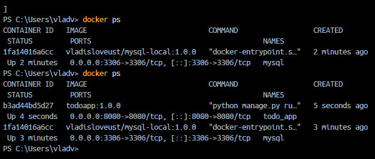
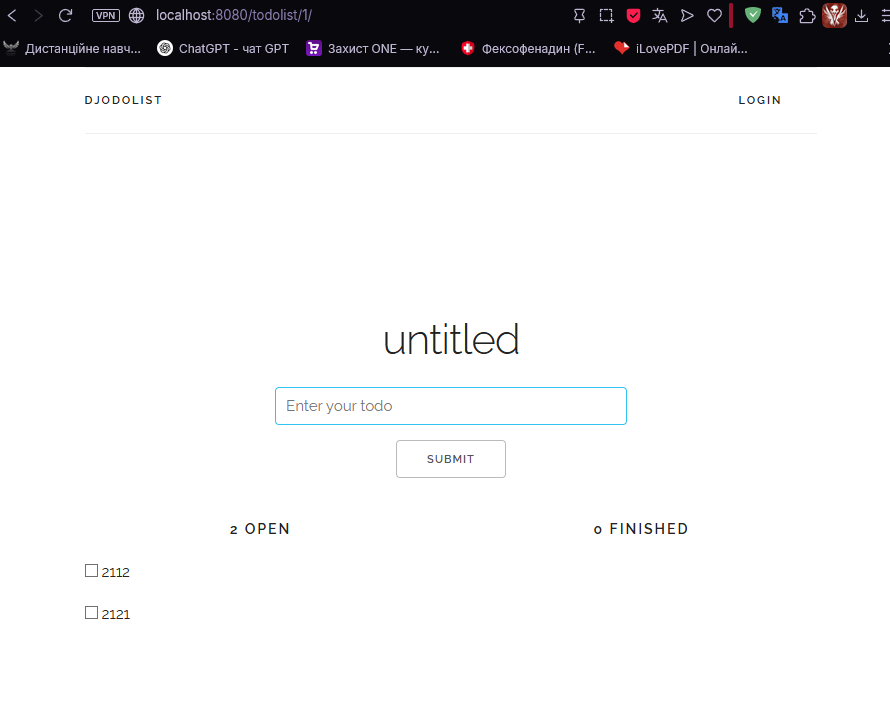

1. Run MySQL Container with a Volume:
docker run -d --name mysql-local -p 3306:3306 -v my-mysql-data:/var/lib/mysql vladisloveust/mysql-local:1.0.0

2. Run Application Container and Connect to MySQL:
docker run -d --name todo_app -p 8080:8080 todoapp:2.0.0 

3. Access the Application in Browser
http://localhost:8080

4. Link to my Docker Hub repository
https://hub.docker.com/repositories/vladisloveust/todoapp
https://hub.docker.com/repository/docker/vladisloveust/mysql-local

5. Connectivity app-to-MySQL
Create a user-defined network: docker network create app-net
Run MySQL on that network with a known container name: --network app-net --name mysql-local
Run the app on the same network and set DB host env var to mysql-local (or document Django settings using host mysql-local, port 3306, db app_db, user app_user, pass 1234). Example: docker run -d --network app-net -p 8080:8080 -e DB_HOST=mysql-local -e DB_NAME=app_db -e DB_USER=app_user -e DB_PASSWORD=1234 todoapp:2.0.0

